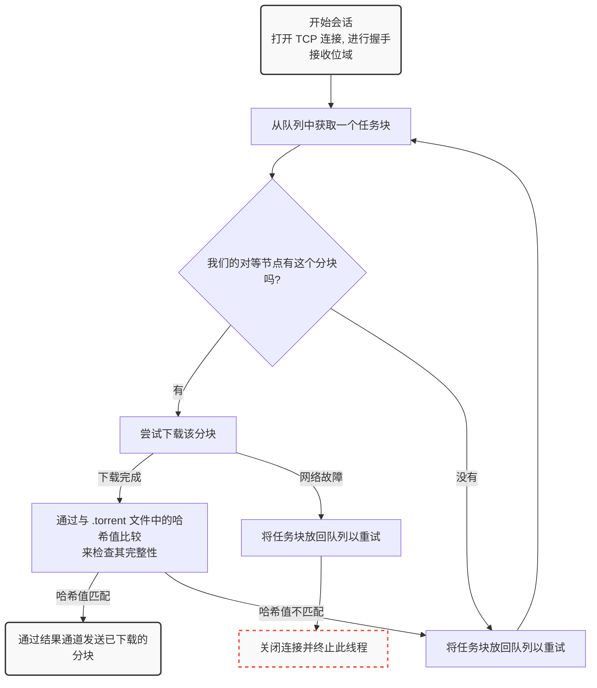

<script setup>
import HoverNote from '@/theme/components/HoverNote.vue'
const text_http = "一些Tracker使用UDP二进制协议来节省带宽"
const text_dht = `DHT网络`
const text_pex = "节点交换"
const text_magnet_link = "百度：https://baike.baidu.com/item/磁力链接/5867775\r\nwiki：https://zh.wikipedia.org/wiki/磁力链接"
const text_preimage_attack = "是密码学中的一种破译手段，用于密码散列函数上寻找含有特定哈希值的消息。"
const text_little_endian_decoded = "以小端序解释相同的字节将使0xE11A=57626"
</script>

# 在Go中从头开始构建BitTorrent客户端

> [!NOTE] 前言
> 原文链接：<https://blog.jse.li/posts/torrent>
>
> 原文作者：Jesse Li
>
> 译者：[Cheng](https://github.com/ChengCY-2254)
>
> 译者述：在原文中，提到有中文翻译，但是，我点进去发现指向的网站已经消失，所以决定自行翻译内容。
>
> 翻译的方式是机器翻译加人工检查，所以如果有错误翻译，请联系我。

**作者前言**：在从海盗湾下载MP3文件之间，完整的过程是什么？在这篇帖子里，我们将实现BitTorrent协议来下载Debian。查看[源代码](https://github.com/veggiedefender/torrent-client/)或者直接查看[内容汇总](#整体整合)。

这篇文章也有[俄语](https://web.archive.org/web/20200616163517if_/https://4gophers.ru/articles/bittorrent/#.Xuj0zivLerw)、[韩语](https://markruler.github.io/posts/go/building-bittorrent-client/)版本。

BitTorrent是一种用于在Internet上下载和分发文件的协议。与传统的客户端/服务器关系相比，下载着链接到中央服务器（例如：在Netfix上观看电影，或加载您正在阅读的网页），BitTorrent网络的参与者（称为**对等节点**）会*互相*下载文件片段--这就是使其成为**点对点**协议的原因。我们将研究其工作原理，并构建我们自己的客户端，该客户端可以找到Peer节点并在它们之间交换数据。


该协议在过去的20年间逐步演化，众多开发者和组织为其添加了诸多扩展功能，例如加密传输、私有种子以及新型节点发现机制。但为了确保项目快速完成，我们仅实现2001年的原始协议规范。

我们将使用[Debian ISO](https://cdimage.debian.org/debian-cd/current/amd64/bt-cd/#indexlist)文件作为我们的小白鼠，因为它比较大但又不是特别打，作为一个流行的Linux发行版，会有许多p2p节点供我们连接。我们要避免盗版内容相关的法律和道德问题。

::: details 这是作者的公益捐款信息
Consider donating to a local community bail fund.

Your money will pay for legal aid and bail for protestors who have been arrested for standing up to police brutality, institutional racism, and the murder of Black men and women like George Floyd, Breonna Taylor, Ahmaud Arbery, and Nina Pop.

In the tech community, we talk a lot about inclusivity and diversity. Now is the time to take concrete action.

<https://www.communityjusticeexchange.org/nbfn-directory>
:::

## 寻找p2p节点

这里有一个问题：我们想用BitTorrent下载文件时，这种P2P协议需要我们找到其它节点来获取数据，但一开始去哪里找到这些节点呢？

这就像初来乍到一座新城市想结交朋友--总得先去广场或公园混个脸熟吧？Tracker的作用正是充当这类「热门据点」，它是帮助节点互相牵线的中心服务器。本质上只是一个跑<HoverNote triggerText="Http" :note="text_http"/>的一个网页服务器，比如Debian的官方Tracker服务器：<http://bttracker.debian.org:6969>


当然，如果这些服务器帮人散播盗版内容，则可能遭遇**FBI OPEN THE DOOR**。
你可能看到过有关某某BT服务器被封禁的新闻。现在，新的方法将通过分布式节点发现，省略了中间环节。
如果你对这些感兴趣，可以研究这些术语：<HoverNote triggerText="DHT" :note="text_dht"/>、<HoverNote triggerText="PEX" :note="text_pex"/>和磁力链接。

## 解析.torrent文件

一个.torrent文件描述了可做种文件的内容以及tracker服务器的信息。有了它我们就能开启一个下载任务。以Debian的.torrent文件为例，其结构如下所示：

```txt
d8:announce41:http://bttracker.debian.org:6969/announce7:comment35:"Debian CD from cdimage.debian.org"13:creation datei1573903810e9:httpseedsl145:https://cdimage.debian.org/cdimage/release/10.2.0//srv/cdbuilder.debian.org/dst/deb-cd/weekly-builds/amd64/iso-cd/debian-10.2.0-amd64-netinst.iso145:https://cdimage.debian.org/cdimage/archive/10.2.0//srv/cdbuilder.debian.org/dst/deb-cd/weekly-builds/amd64/iso-cd/debian-10.2.0-amd64-netinst.isoe4:infod6:lengthi351272960e4:name31:debian-10.2.0-amd64-netinst.iso12:piece lengthi262144e6:pieces26800:�����PS�^�� (每块哈希的二进制)
```

这些混乱的字符是以一种被称为**Bencode**（发音为bee-encode）的格式编码的内容，我们需要对其进行解码。

Bencode可以编码与JSON大致相同的数据结构，包括字符串、整数、列表和字典。虽然不如JSON那么只关可读，但Bencode特别擅长处理二进制数据，且流式解析非常简单。其编码规则如下：

- 字符串：附带长度前缀例如`4:spam`表示`spam`
- 数字：用`i`和`e`包裹，如`i7e`就代表数字7
- 列表：用`l`和`e`包裹元素，如`l4:spami7ee`对应的是`['spam',7]`
- 字典：用`d`和`e`包裹键值对，如`d4:spami7ee`表示`{'spam':7}`

让我们对其进行格式化一下，格式化后的.torrent文件看起来是这样：

```txt
d
  8:announce
    41:http://bttracker.debian.org:6969/announce
  7:comment
    35:"Debian CD from cdimage.debian.org"
  13:creation date
    i1573903810e
  4:info
    d
      6:length
        i351272960e
      4:name
        31:debian-10.2.0-amd64-netinst.iso
      12:piece length
        i262144e
      6:pieces
        26800:�����PS�^�� (每块哈希的二进制内容)
    e
e
```

在这个文件中，我们可以找到tracker服务器的URL、创建日期（Unix时间戳格式）、文件名和大小，以及一个大型的二进制数据块--包含我们要下载文件中每个分片的SHA-1哈希值。这些分片是文件的大小相等的部分。一个片段的确切大小因种子而异，但它们通常在256KB到1MB之间。这意味着一个大文件可能由数千个分片组成。我们将从节点下载这些分片，将它们与我们的torrent文件中的哈希值进行比对，将它们组装起来，我们就能得到一个完整的文件了。


这种机制使我们能够在下载过程中注意验证每个分片的完整性。这使得BitTorrent能够抵御意外损坏或恶意种子污染攻击。除非攻击者能够通过<HoverNote triggerText="原像攻击" :note="text_preimage_attack"/>破解SHA-1算法，否则我们一定能够获得请求的准确内容。

虽然编写bencode解析器很有意思，但解析它不是我们今天的重点。
我发现Fredrik Lundh的[50行解析器](https://web.archive.org/web/20200105114449/https://effbot.org/zone/bencode.htm)特别有启发性。对于这个项目，我使用了[github.com/jackpal/bencode-go](https://github.com/jackpal/bencode-go)

```go
import (
    "github.com/jackpal/bencode-go"
)

type bencodeInfo struct {
    Pieces      string `bencode:"pieces"`
    PieceLength int    `bencode:"piece length"`
    Length      int    `bencode:"length"`
    Name        string `bencode:"name"`
}

type bencodeTorrent struct {
    Announce string      `bencode:"announce"`
    Info     bencodeInfo `bencode:"info"`
}

// 打开并解析种子文件
func Open(r io.Reader) (*bencodeTorrent, error) {
    bto := bencodeTorrent{}
    err := bencode.Unmarshal(r, &bto)
    if err != nil {
        return nil, err
    }
    return &bto, nil
}
```

因为我喜欢让我的结构体保持扁平，并且我喜欢将我的应用程序结构与我的序列化结构分开，所以我导出了一个名为`TorrentFile`的结构，并编写了一些辅助函数来进行两者之间的互相转换。

需要注意的一点是，我将`pieces`（之前是一个字符串）拆分成哈希切片（`[20]byte`），一边后续可以方便地访问单个哈希。我还计算了整个`bencoded`信息字典（包括文件名、大小和分片哈希）的SHA-1哈希值。我们将其称为**infohash**，当我们的tracker与节点通讯时，它会是Tracker和节点间识别文件的唯一标识符。其具体作用我们稍后会详细展开。


```go {3,4}
type TorrentFile struct {
    Announce    string
    InfoHash    [20]byte
    PieceHashes [][20]byte
    PieceLength int
    Length      int
    Name        string
}
func (bto bencodeTorrent) toTorrentFile() (TorrentFile, error) {
// …
}
```

## 从tracker中检索对等节点

既然我们已经获取了文件极其tracker的信息，现在让我们联系tracker来宣告我们作为节点的存在，并获取其它节点列表。我们只需要向`.torrent`文件中提供的`announce`URL发起GET请求，附带几个查询参数即可：

```go
func (t *TorrentFile) buildTrackerURL(peerID [20]byte, port uint16) (string, error) {
    base, err := url.Parse(t.Announce)
    if err != nil {
        return "", err
    }
    params := url.Values{
        "info_hash":  []string{string(t.InfoHash[:])},
        "peer_id":    []string{string(peerID[:])},
        "port":       []string{strconv.Itoa(int(Port))},
        "uploaded":   []string{"0"},
        "downloaded": []string{"0"},
        "compact":    []string{"1"},
        "left":       []string{strconv.Itoa(t.Length)},
    }
    base.RawQuery = params.Encode()
    return base.String(), nil
}
```

重要的参数包括：

- **`info_hash`**：用来表示我们要下载的文件。就是我们之前从bencoded`info`字典中计算得出的`infohash`，tracker将使用这个参数来确定要向我们展示哪些节点。
- **`peer_id`**：用于向tracker和其它节点表示我们身份的20字节名称。我们只需要随机生成20个字节即可。实际的BitTorrent客户端会有像`-TR2940-k8hj0wgej6ch`的ID，用于表示客户端软件和版本，在该例子中，TR2940代表Transmission客户端2.94版本。


## 解析tracker响应

我们得到一个bencoded响应

```txt
d
  8:interval
    i900e
  5:peers
    252:(another long binary blob)
e
```

其中，`interval`告诉我们应该多久重新连接tracker以刷新节点列表。它的值为900表示我们应该每15分钟（900秒）重新连接一次。

`Peers`是另一个长二进制内容，其包含每个Peer节点的IP地址。它由**每组6个字节**的数据构成。每组的前4个字节代表的是IP地址--每个字节对应IP中的一个数字。最后2字节代表端口号，以大端序`uint16`格式存储。**大端序**，或**网络字节序**意味着我们可以通过从做到右拼接字节来将其解释为整数。例如，字节`0x1A`和`0xE1`组合成`0x1AE1`,<HoverNote triggerText="即十进制的6681" :note="text_little_endian_decoded"/>。


```go
// 对等节点的连接信息
type Peer struct {
    IP   net.IP
    Port uint16
}

// 解析缓冲区中的对等IP地址和端口
func Unmarshal(peersBin []byte) ([]Peer, error) {
    const peerSize = 6 // 4 for IP, 2 for port
    numPeers := len(peersBin) / peerSize
    if len(peersBin)%peerSize != 0 {
        err := fmt.Errorf("Received malformed peers")
        return nil, err
    }
    peers := make([]Peer, numPeers)
    for i := 0; i < numPeers; i++ {
        offset := i * peerSize
        peers[i].IP = net.IP(peersBin[offset : offset+4])
        peers[i].Port = binary.BigEndian.Uint16(peersBin[offset+4 : offset+6])
    }
    return peers, nil
}
```

# 从P2P节点下载

现在我们已经有了P2P节点列表了，是时候联系他们并开始下载内容了！我们可以将这个过程分解为几个步骤。对于每个Peer节点，我们希望：

1. 启动与P2P节点的TCP连接。就像是开始打电话一样。
2. 完成BT协议的双向**握手**。"Hello?" "Hello."
3. 交换消息以下载分片（**pices**），“我想要第231号分片”

## 启动TCP连接

```go
conn, err := net.DialTimeout("tcp", peer.String(), 3*time.Second)
if err != nil {
    return nil, err
}
```

我们添加了一个超时，这样我就不会在无法连接上的P2P节点上浪费太多时间。在大多数情况下，这是一个非常标准的TCP连接。

## 完成握手

我们刚刚建立了与P2P节点的连接，但我们想进行握手来验证我们的假设，即P2P节点

- 可以使用BitTorrent协议进行通讯
- 能够理解并回复我们的消息
- 具有我们想要的文件，至少知道我们在说什么


就像人际交往中握手有讲究一样，BitTorrent协议也有自己的'握手'规范。一次完整的协议握手必须包含以下五个要素：

1. 协议标识符的长度，始终为19（十六进制的0x13）
2. 协议标识符，称为**pstr**，始终为`BitTorrent protocol`
3. 八个**保留字节**，全部设置为0。我们会将其中一些API变成1以表明我们支持某些[扩展](http://www.bittorrent.org/beps/bep_0010.html)。但我们没有，所以我们会将它们保持为0。
4. 我们之前计算的`infohash`以确定我们想要的文件
5. 我们构建的**Peer ID**用于识别自己的身份

完整的协议握手报文示例：

```txt
\x13BitTorrent protocol\x00\x00\x00\x00\x00\x00\x00\x00\x86\xd4\xc8\x00\x24\xa4\x69\xbe\x4c\x50\xbc\x5a\x10\x2c\xf7\x17\x80\x31\x00\x74-TR2940-k8hj0wgej6ch
```

当我们向节点发送握手信息后，应该会收到相同格式的握手回复。返回的infohash应该与我们发送的相匹配，这样才能确认我们在讨论同一个文件。如果一切顺利，就可以继续了。如果出现问题，我们可以断开连接，因为这意味着我们敲错了门。就像是要去蜜雪冰城，结果错误的走进了瑞幸咖啡。

在我们的代码中，专门编写一个结构来表示握手，并编写一些方法来序列化和反序列化。

```go
// 握手是一种特殊的消息，用于识别对等节点
type Handshake struct {
    Pstr     string
    InfoHash [20]byte
    PeerID   [20]byte
}

// 将握手内容序列化到缓冲区，准备发送
func (h *Handshake) Serialize() []byte {
    buf := make([]byte, len(h.Pstr)+49)
    buf[0] = byte(len(h.Pstr))
    curr := 1
    curr += copy(buf[curr:], h.Pstr)
    curr += copy(buf[curr:], make([]byte, 8)) // 8 reserved bytes
    curr += copy(buf[curr:], h.InfoHash[:])
    curr += copy(buf[curr:], h.PeerID[:])
    return buf
}

// 从流中读取并解析握手消息
func Read(r io.Reader) (*Handshake, error) {
    // 使用反序列化读取消息
    // ...
}
```

## 发送和接收消息

完成初始握手后，我们就可以收发消息了。不过严格来说--如果对方还没准备好接收消息，在它通知我们已经准备好之前，我们不能发送任何消息。这种状态下，我们被视为对等节点阻塞（**choked**）。对等节点会发送一个解除阻塞（**unchoke**）消息告知我们可以开始请求数据。默认情况下，我们假设处于被阻塞的状态，除非收到解除阻塞的通知。

一旦我们被解除阻塞（unchoked），就可以开始发送**分片请求**，而对方也可以向我们发送包含**数据分片**的回复消息。


### 解释消息

一条消息具有`length`、`ID`和`payload`，例如：


消息以长度指示器开头，该字段告知我们消息的总字节长度。它是一个32为整数，由四个字节按**大端序**拼接而成。
随后一个字节是消息ID，表明接收的消息类型--例如ID值2表示`interested`（感兴趣）。最后是可选的`payload`（有效载荷），占据消息的剩余长度。

```go
type messageID uint8

const (
    MsgChoke         messageID = 0
    MsgUnchoke       messageID = 1
    MsgInterested    messageID = 2
    MsgNotInterested messageID = 3
    MsgHave          messageID = 4
    MsgBitfield      messageID = 5
    MsgRequest       messageID = 6
    MsgPiece         messageID = 7
    MsgCancel        messageID = 8
)

// Message stores ID and payload of a message
type Message struct {
    ID      messageID
    Payload []byte
}

// Serialize serializes a message into a buffer of the form
// <length prefix><message ID><payload>
// Interprets `nil` as a keep-alive message
func (m *Message) Serialize() []byte {
    if m == nil {
        return make([]byte, 4)
    }
    length := uint32(len(m.Payload) + 1) // +1 for id
    buf := make([]byte, 4+length)
    binary.BigEndian.PutUint32(buf[0:4], length)
    buf[4] = byte(m.ID)
    copy(buf[5:], m.Payload)
    return buf
}
```

要从流中读取报文，我们需要遵循报文的格式。先读取四个字节并将其解释为`uint32`以获取报文总长，接着连续读取该长度对应的字节流，其首字节为消息类型ID，后续字节为有效载荷数据。

```go
// Read parses a message from a stream. Returns `nil` on keep-alive message
func Read(r io.Reader) (*Message, error) {
    lengthBuf := make([]byte, 4)
    _, err := io.ReadFull(r, lengthBuf)
    if err != nil {
        return nil, err
    }
    length := binary.BigEndian.Uint32(lengthBuf)

    // keep-alive message
    if length == 0 {
        return nil, nil
    }

    messageBuf := make([]byte, length)
    _, err = io.ReadFull(r, messageBuf)
    if err != nil {
        return nil, err
    }

    m := Message{
        ID:      messageID(messageBuf[0]),
        Payload: messageBuf[1:],
    }

    return &m, nil
}
```

### Bitfields 位域

最有意思的报文类型之一是**位域（bitfield）**，这是一种节点用来高效编码其可提供分片的数据结构。位域看起来就像是一个字节数组，要检查节点拥有哪些分片，我们只需要查看哪些位被**设置为1**。你可以将其看作是游乐园发给你的打卡小册子：初始是一个**全0**的空白本本，通过将特定比特位翻转成1来标记‘已打卡’的位置。


通过使用*位*而不是*字节*，这种数据结构会非常紧凑。我们可以在单个字节的空间（一个布尔值大小）中塞入八个分片的信息。代价是访问时会稍微复杂些。计算机可寻址的最小内存单元是字节，因此如果要获取我们的比特位，我们必须进行一些**位操作**：

```go
// A Bitfield represents the pieces that a peer has
type Bitfield []byte

// HasPiece tells if a bitfield has a particular index set
func (bf Bitfield) HasPiece(index int) bool {
    byteIndex := index / 8
    offset := index % 8
    return bf[byteIndex]>>(7-offset)&1 != 0
}

// SetPiece sets a bit in the bitfield
func (bf Bitfield) SetPiece(index int) {
    byteIndex := index / 8
    offset := index % 8
    bf[byteIndex] |= 1 << (7 - offset)
}
```

## 整体整合

现在我们用于下载种子所需要的所有工具：从tracker获得的节点列表，能够建立TCP连接、法器握手、收发消息来与它们通信。我们最后的难题主要是处理同时与多个节点通信的**并发问题**，以及管理节点交互时的**状态维护**。这两个都是经典的难题。

### 管理并发，作为队列的channel

在go语言中，我们通过[通信来共享内存](https://blog.golang.org/share-memory-by-communicating)，我们可以将go channel视为一个轻量级的线程安全队列。我们将建立两个channel来同步并发工作协程：一个用于在节点间分配任务（要下载的分片），另一个用于收集已下载的分片。当下载的分片通过result channel到达的时候，我们可以将它们复制到缓冲区中开始组装完整的文件。

```go
// Init queues for workers to retrieve work and send results
workQueue := make(chan *pieceWork, len(t.PieceHashes))
results := make(chan *pieceResult)
for index, hash := range t.PieceHashes {
    length := t.calculatePieceSize(index)
    workQueue <- &pieceWork{index, hash, length}
}

// Start workers
for _, peer := range t.Peers {
    go t.startDownloadWorker(peer, workQueue, results)
}

// Collect results into a buffer until full
buf := make([]byte, t.Length)
donePieces := 0
for donePieces < len(t.PieceHashes) {
    res := <-results
    begin, end := t.calculateBoundsForPiece(res.index)
    copy(buf[begin:end], res.buf)
    donePieces++
}
close(workQueue)
```

我们为从tracker获取的每个节点创建一个工作协程（goroutine）。该协程会与节点建立连接并完成握手，然后开始从`workQueue`获取任务，尝试下载对应分片，并通过**result channel**将下载完成的分片送回。



```go
func (t *Torrent) startDownloadWorker(peer peers.Peer, workQueue chan *pieceWork, results chan *pieceResult) {
    c, err := client.New(peer, t.PeerID, t.InfoHash)
    if err != nil {
        log.Printf("Could not handshake with %s. Disconnecting\n", peer.IP)
        return
    }
    defer c.Conn.Close()
    log.Printf("Completed handshake with %s\n", peer.IP)

    c.SendUnchoke()
    c.SendInterested()

    for pw := range workQueue {
        if !c.Bitfield.HasPiece(pw.index) {
            workQueue <- pw // Put piece back on the queue
            continue
        }

        // Download the piece
        buf, err := attemptDownloadPiece(c, pw)
        if err != nil {
            log.Println("Exiting", err)
            workQueue <- pw // Put piece back on the queue
            return
        }

        err = checkIntegrity(pw, buf)
        if err != nil {
            log.Printf("Piece #%d failed integrity check\n", pw.index)
            workQueue <- pw // Put piece back on the queue
            continue
        }

        c.SendHave(pw.index)
        results <- &pieceResult{pw.index, buf}
    }
}
```

### 管理状态

我们将用一个结构体来跟踪每个节点的状态，并在读取消息时修改该结构体。它会包含注入我们从该节点下载了多少数据、我们向它请求了多少数据、以及我们是否被阻塞（choked）等信息。如果想要进一步扩展，可以将其抽象为有限状态机。但目前使用结构体和switch语句就足够了。

```go
type pieceProgress struct {
    index      int
    client     *client.Client
    buf        []byte
    downloaded int
    requested  int
    backlog    int
}

func (state *pieceProgress) readMessage() error {
    msg, err := state.client.Read() // this call blocks
    switch msg.ID {
    case message.MsgUnchoke:
        state.client.Choked = false
    case message.MsgChoke:
        state.client.Choked = true
    case message.MsgHave:
        index, err := message.ParseHave(msg)
        state.client.Bitfield.SetPiece(index)
    case message.MsgPiece:
        n, err := message.ParsePiece(state.index, state.buf, msg)
        state.downloaded += n
        state.backlog--
    }
    return nil
}
```

### 开始发起请求

文件、分片和分片哈希还不是全部--我们可以进一步将分片拆分为**块**（block）。一个块是分片的一部分，可以通过它所属分片的索引、在分片中的字节**偏移量**和长度来完整定义。当我们向节点请求数据时，实际上是在请求一个块。一个块通常是16kb大小，这意味着单个256kb的分片实际上可能需要16次请求。

按照规范，如果收到超过16kb的块请求，节点应当断开连接。但根据我的经验，它们通常很乐意满足最大128kb的请求。不过使用更大的块尺寸只带来了有限的速度提升，所以最好还是遵守规范。

### 流水线操作

网络往返通信的成本很高，若逐块发起请求将会严重拖累下载性能。因此必须采用流水线请求机制：保持一定数量的未完成请求。这能将连接吞吐量提升一个数量级。


传统上，BT客户端会保持5个流水线请求的队列，这也是我将采用的值。我发现增加队列大小最高可提升一倍的下载速度。较新的客户端采用[自适应队列](https://luminarys.com/posts/writing-a-bittorrent-client.html)大小，以更好地适应现代网络速度和条件。这绝对是一个值得调整的参数，也是未来性能优化中唾手可得的成果。

```go
// MaxBlockSize is the largest number of bytes a request can ask for
const MaxBlockSize = 16384

// MaxBacklog is the number of unfulfilled requests a client can have in its pipeline
const MaxBacklog = 5

func attemptDownloadPiece(c *client.Client, pw *pieceWork) ([]byte, error) {
    state := pieceProgress{
        index:  pw.index,
        client: c,
        buf:    make([]byte, pw.length),
    }

    // Setting a deadline helps get unresponsive peers unstuck.
    // 30 seconds is more than enough time to download a 262 KB piece
    c.Conn.SetDeadline(time.Now().Add(30 * time.Second))
    defer c.Conn.SetDeadline(time.Time{}) // Disable the deadline

    for state.downloaded < pw.length {
        // If unchoked, send requests until we have enough unfulfilled requests
        if !state.client.Choked {
            for state.backlog < MaxBacklog && state.requested < pw.length {
                blockSize := MaxBlockSize
                // Last block might be shorter than the typical block
                if pw.length-state.requested < blockSize {
                    blockSize = pw.length - state.requested
                }

                err := c.SendRequest(pw.index, state.requested, blockSize)
                if err != nil {
                    return nil, err
                }
                state.backlog++
                state.requested += blockSize
            }
        }

        err := state.readMessage()
        if err != nil {
            return nil, err
        }
    }

    return state.buf, nil
}
```

### main.go

这是一段非常简短的代码，我们快要完成了。

```go
package main

import (
    "log"
    "os"

    "github.com/veggiedefender/torrent-client/torrentfile"
)

func main() {
    inPath := os.Args[1]
    outPath := os.Args[2]

    tf, err := torrentfile.Open(inPath)
    if err != nil {
        log.Fatal(err)
    }

    err = tf.DownloadToFile(outPath)
    if err != nil {
        log.Fatal(err)
    }
}
```

<iframe src="https://asciinema.org/a/xqRSB0Jec8RN91Zt89rbb9PcL/iframe?" title= "终端会话记录" style = "overflow: hidden; margin: 0px; border: 0px; display: inline-block; width: 100%; float: none; visibility: visible; height: 407px;"/>

# 这还尚未结束

为了内容简洁，我只包含了部分重要的代码片段。省去了所有胶水代码、解析逻辑、单元测试，以及那些构建解析的无聊部分。如果您有兴趣，请查看我的[代码仓库](https://github.com/veggiedefender/torrent-client)。

::: details 作者的广告
This is an ad.

If you’d like to try building a BitTorrent client yourself, but could use some structure and personalized guidance, consider using CodeCrafters.

They make programming challenges for experienced engineers (e.g Build your own Git, Docker, Redis etc). In particular,
they offer a BitTorrent challenge which walks you through everything described in this post — parsing bencode, discovering peers, and downloading pieces — with test harnesses and scaffolding code for a bunch of languages.

It’s a paid service, but you can get a discount with my referral link: <https://app.codecrafters.io/join?via=veggiedefender>
:::
